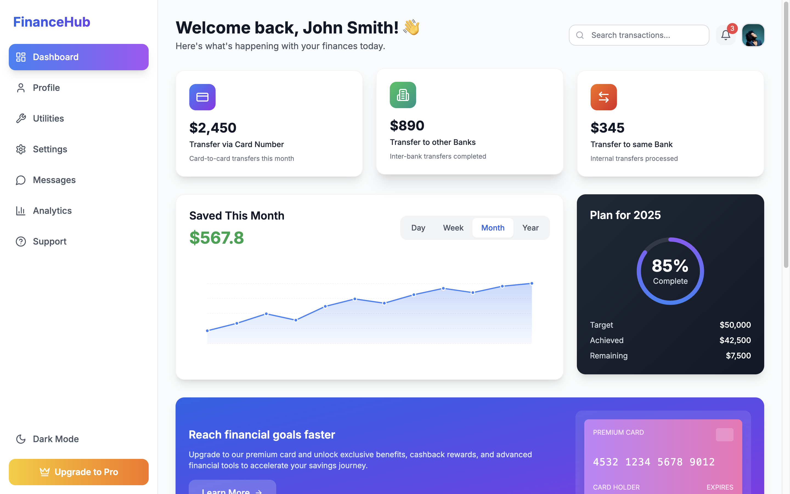
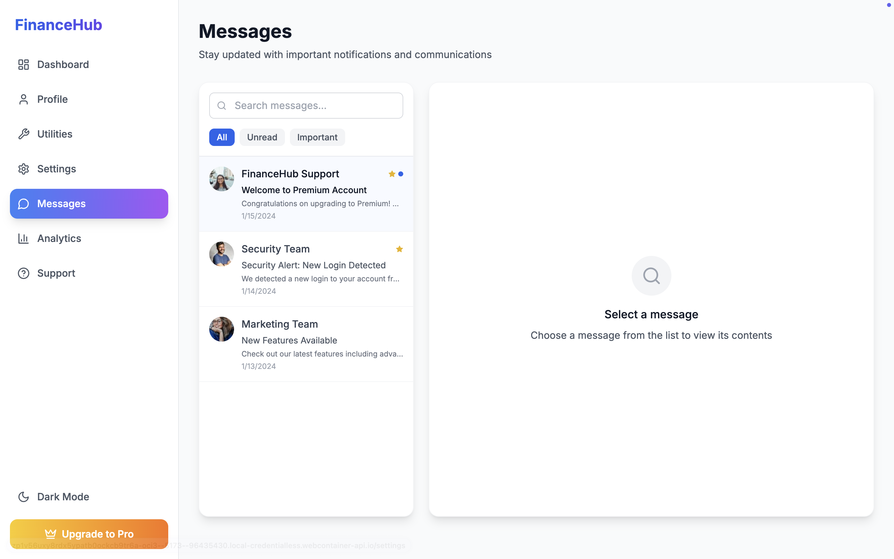
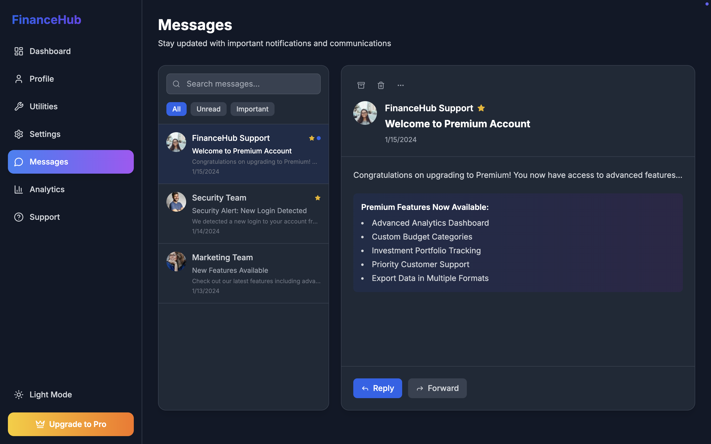
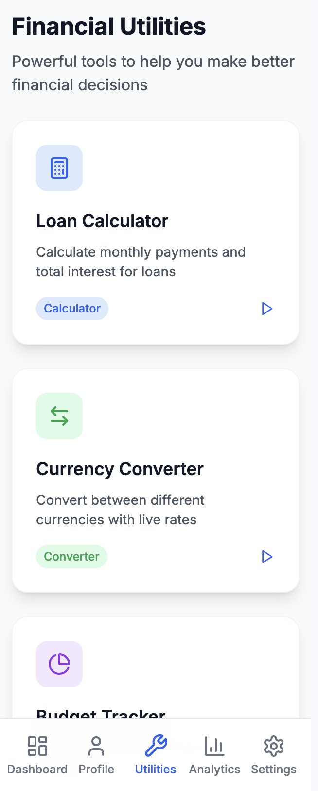
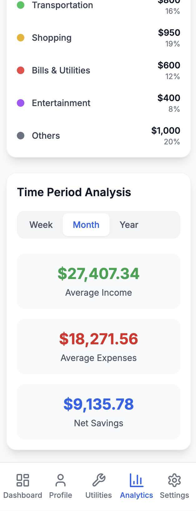
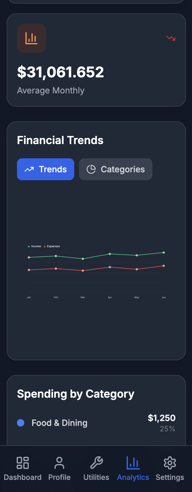
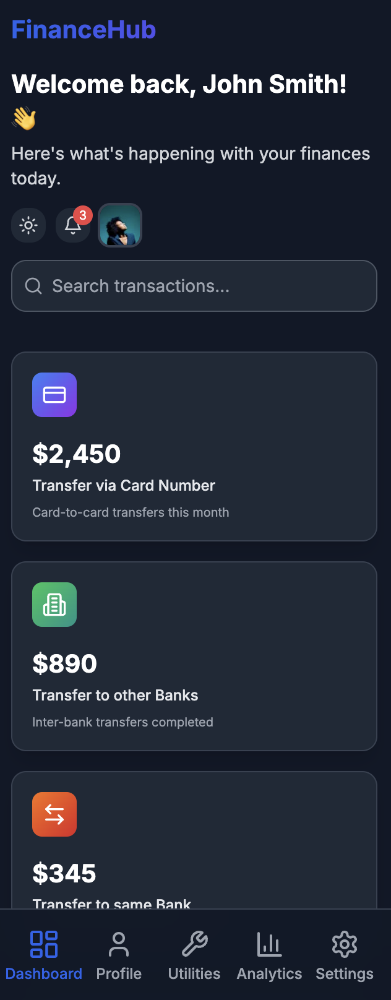

# FinanceHub - Modern Financial Dashboard

[](https://modern-financial-das-gd0a.bolt.host)
[](https://github.com/yourusername/financehub)
[](LICENSE)

<div align="center">
  <h2>🚀 <a href="https://modern-financial-das-gd0a.bolt.host">Try Live Demo</a> 🚀</h2>
  <p><strong>Experience the full functionality of FinanceHub with our interactive demo</strong></p>
</div>

## 📸 Screenshots

<div align="center">

<table>
<tr>
<td align="center" width="50%">
<h3>📊 Dashboard Overview</h3>

</td>
<td align="center" width="50%">
<h3>💬 Messages</h3>

</td>
</tr>
<tr>
<td align="center" colspan="2">
<h3>🌙 Dark Mode</h3>

</td>
</tr>
</table>

<h3>📱 Mobile Version</h3>
<table>
<tr>
<td align="center" width="25%">

<br><strong>Dashboard</strong>
</td>
<td align="center" width="25%">

<br><strong>Analytics</strong>
</td>
<td align="center" width="25%">

<br><strong>Analytics</strong>
</td>
<td align="center" width="25%">

<br><strong>Dashboard</strong>
</td>
</tr>
</table>

</div>
---

## 🌟 **Key Features at a Glance**

<div align="center">

| 📊 **Dashboard** | 👤 **Profile** | 🔧 **Utilities** | 📈 **Analytics** |
|:---:|:---:|:---:|:---:|
| Real-time metrics | Complete customization | Loan calculator | Trend analysis |
| Interactive charts | Avatar management | Currency converter | Category breakdown |
| Goal tracking | Security settings | Budget tracker | Growth tracking |
| Transaction history | Multi-language | Investment planner | Visual reports |

</div>

### ✨ **What Makes FinanceHub Special?**

- 🎨 **Modern Design**: Apple-level aesthetics with smooth animations
- 📱 **Fully Responsive**: Perfect on mobile, tablet, and desktop
- 🌙 **Dark Mode**: Complete dark theme support
- ⚡ **Lightning Fast**: Optimized performance and quick navigation
- 🔒 **Secure**: Bank-level security with privacy controls
- 🛠️ **Feature Rich**: Everything you need for financial management

---

> A modern, responsive financial dashboard built with React, TypeScript, and Tailwind CSS. Manage your finances with ease through an intuitive and feature-rich interface.

## ✨ Features

### 📊 **Dashboard**
- Real-time financial metrics and KPIs
- Interactive savings chart with multiple time periods
- Transaction and transfer history
- Progress tracking for financial goals
- Premium card management

### 👤 **Profile Management**
- Complete user profile customization
- Avatar upload and management
- Personal preferences (language, currency)
- Account type management (Basic, Premium, Enterprise)
- Security settings

### 🔧 **Financial Utilities**
- **Loan Calculator**: Calculate monthly payments and total interest
- **Currency Converter**: Real-time currency conversion
- **Budget Tracker**: Track monthly expenses (Coming Soon)
- **Investment Planner**: Portfolio management tools (Coming Soon)

### 📈 **Analytics**
- Comprehensive financial trend analysis
- Category-based spending breakdown
- Interactive charts and visualizations
- Monthly growth tracking
- Customizable time period analysis

### 💬 **Communication**
- **Messages**: Inbox with filtering and search
- **Support System**: FAQ, ticket management, and live chat
- **Notifications**: Real-time updates and alerts

### ⚙️ **Settings**
- Dark/Light mode toggle
- Notification preferences
- Privacy and security controls
- Language and region settings
- Account management tools

## 🚀 Live Demo

**[View Live Demo →](https://modern-financial-das-gd0a.bolt.host)**

Experience the full functionality of FinanceHub with our interactive demo.

## 🛠️ Tech Stack

- **Frontend**: React 18, TypeScript
- **Styling**: Tailwind CSS
- **Icons**: Lucide React
- **Routing**: React Router DOM
- **Build Tool**: Vite
- **Deployment**: Bolt Hosting

## 📱 Responsive Design

FinanceHub is built with a mobile-first approach, ensuring optimal experience across all devices:

- **Mobile**: Touch-optimized interface with bottom navigation
- **Tablet**: Adaptive layout with enhanced touch targets
- **Desktop**: Full sidebar navigation with advanced features
- **Dark Mode**: Complete dark theme support

## 🎨 Design Features

- **Modern UI/UX**: Clean, intuitive interface design
- **Smooth Animations**: Micro-interactions and transitions
- **Accessibility**: WCAG compliant with proper contrast ratios
- **Performance**: Optimized for fast loading and smooth interactions

## 🏗️ Project Structure

```
src/
├── components/
│   ├── Dashboard/          # Dashboard-specific components
│   └── Layout/            # Layout components (Sidebar, MobileNav)
├── pages/                 # Page components
├── types/                 # TypeScript type definitions
├── data/                  # Mock data and constants
├── hooks/                 # Custom React hooks
└── styles/               # Global styles and Tailwind config
```

## 🚀 Getting Started

### Prerequisites

- Node.js 18+ 
- npm or yarn

### Installation

1. **Clone the repository**
   ```bash
   git clone https://github.com/yourusername/financehub.git
   cd financehub
   ```

2. **Install dependencies**
   ```bash
   npm install
   ```

3. **Start development server**
   ```bash
   npm run dev
   ```

4. **Build for production**
   ```bash
   npm run build
   ```

## 📋 Available Scripts

- `npm run dev` - Start development server
- `npm run build` - Build for production
- `npm run preview` - Preview production build
- `npm run lint` - Run ESLint

## 🎯 Key Features Showcase

### Dashboard Overview
- **Real-time Metrics**: Track transfers, transactions, and savings
- **Interactive Charts**: Visualize financial data with smooth animations
- **Goal Tracking**: Monitor progress towards financial objectives

### Utility Tools
- **Loan Calculator**: Advanced calculations with detailed breakdowns
- **Currency Converter**: Live exchange rates with multiple currencies
- **Budget Planning**: Comprehensive expense tracking and categorization

### Analytics Engine
- **Trend Analysis**: Identify spending patterns and financial trends
- **Category Insights**: Detailed breakdown of expenses by category
- **Growth Tracking**: Monitor financial growth over time

## 🔒 Security & Privacy

- **Data Protection**: All sensitive data is handled securely
- **Privacy Controls**: Granular privacy settings for users
- **Secure Authentication**: Industry-standard security practices

## 🌟 Performance

- **Fast Loading**: Optimized bundle size and lazy loading
- **Smooth Interactions**: 60fps animations and transitions
- **Mobile Optimized**: Excellent performance on mobile devices

## 🤝 Contributing

Contributions are welcome! Please feel free to submit a Pull Request.

1. Fork the project
2. Create your feature branch (`git checkout -b feature/AmazingFeature`)
3. Commit your changes (`git commit -m 'Add some AmazingFeature'`)
4. Push to the branch (`git push origin feature/AmazingFeature`)
5. Open a Pull Request

## 📄 License

This project is licensed under the MIT License - see the [LICENSE](LICENSE) file for details.

## 👨‍💻 Author

**Your Name**
- GitHub: [@yourusername](https://github.com/yourusername)
- LinkedIn: [Your LinkedIn](https://linkedin.com/in/yourprofile)
- Email: your.email@example.com

## 🙏 Acknowledgments

- Design inspiration from modern fintech applications
- Icons provided by [Lucide](https://lucide.dev/)
- Images from [Pexels](https://pexels.com/)
- Built with [Vite](https://vitejs.dev/) and [React](https://reactjs.org/)

---

<div align="center">
  <strong>⭐ Star this repository if you found it helpful!</strong>
  <br>
  <a href="https://modern-financial-das-gd0a.bolt.host">Live Demo</a> •
  <a href="#-features">Features</a> •
  <a href="#-getting-started">Getting Started</a> •
  <a href="#-contributing">Contributing</a>
</div>